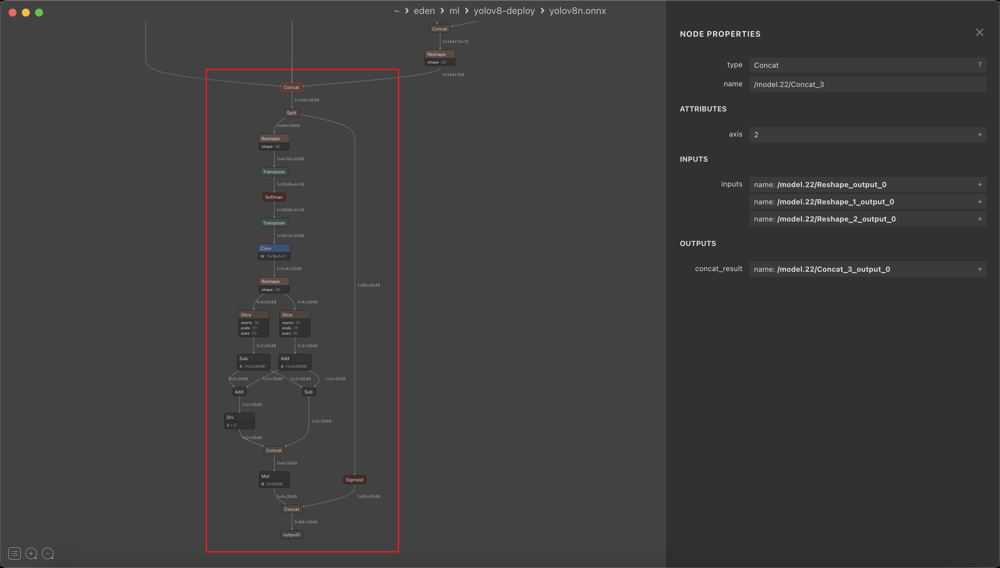
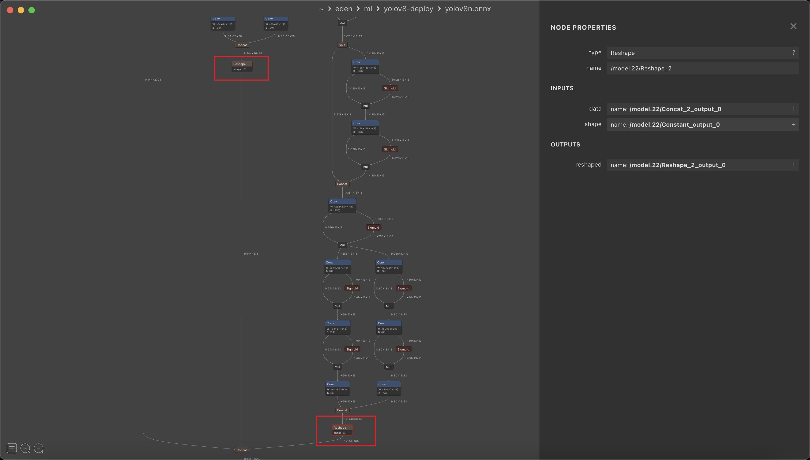
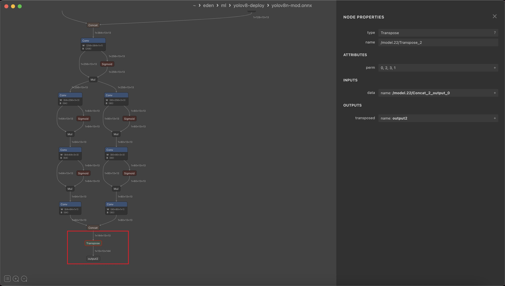

# yolov8-deploy

This is a small utility used to remove the post-processing part of the yolov8 model.

>   ⚠️ **Warning: Only Object Detection is supported right now**

## Why do you need this?

For the deployment side, it is often not a good choice to include post-processing within the model. In specific deployment environments such as NPU or other frameworks like NCNN/RKNN, the presence of post-processing can introduce **unnecessary** or **unsupported operators**, resulting in performance degradation or even **inference failure**.

In the past, the solution was to modify the source code within ultralytics’ package when exporting ONNX models and then revert back before training. However, I found this process cumbersome and time-consuming.  Therefore, I have developed a simple program that allows you to complete the entire process **using official toolchains**. 

By importing models generated through official means and running yolov8-deploy, voila! You will obtain a model file without any post-processing stuff!

## How to use?

1.   Make sure your Python version is >= `3.11`.

2.   Install dependency.

     ```shell
     pip install -r requirements.txt
     ```

3.   Run the mod tool.

     ```shell
     python mod.py -i yolov8n.onnx -o yolov8n-mod.onnx
     # or
     python mod.py --input yolov8m.onnx --output yolov8m.onnx --force
     # more info, please run: python mod.py -h
     ```

4.   Validate result (Optional).

     ```shell
     python infer.py -m yolov8n-mod.onnx -i bus.jpg
     # or
     python infer.py --model yolov8m-mod.onnx -i blabla.jpg
     ```

## How this work?

Let’s compare the files `yolov8n.onnx` and `yolov8n-mod.onnx`.

### Step 1: Chop post-processing related part

*   post-processing part

  

*   `reshape` operator after each detector head

    

### Step 2: Use `transpose` operator to replace `reshape`

>   This step is for the convenience of subsequent processing.
>
>   From $\mathrm{B\times144\times H\times W}$ to $\mathrm{B\times H\times W\times144}$, $144$ represents $80$ categories of scores plus $64$ DFL regression parameters.
>
>   If the toolchain you are using **doesn’t support multiple outputs**, you can add a **concat** operator after these transpose operators to pack them together.



## How to inference the converted model in other languages/platforms?

*   C++: you can refer to this [repo](https://github.com/triple-Mu/ncnn-examples), great shoutout to [triple-Mu](https://github.com/triple-Mu), without him I would not have been able to develop this utility.
*   Python/NCNN: https://github.com/Sped0n/vega/blob/72d8fc4e0b3d3a98e77f1333fbcce3e8206e8fe1/ml/__init__.py#L21-L138

## Credits

*   https://github.com/triple-Mu/ncnn-examples
*   https://zhuanlan.zhihu.com/p/622596922

